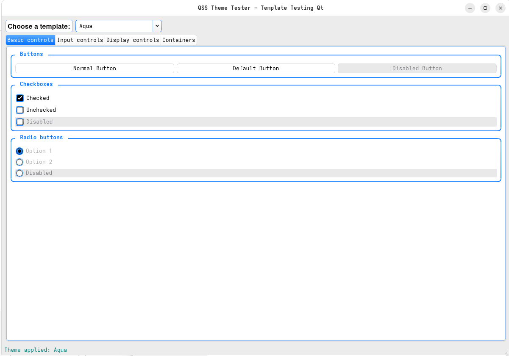
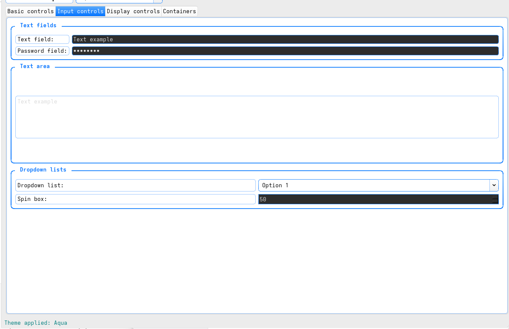
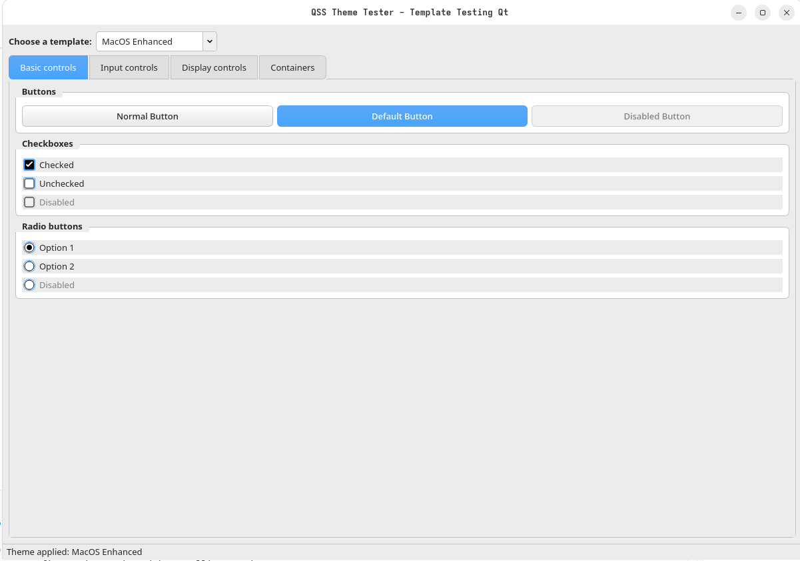
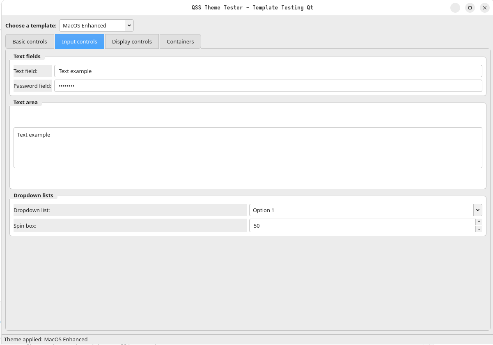
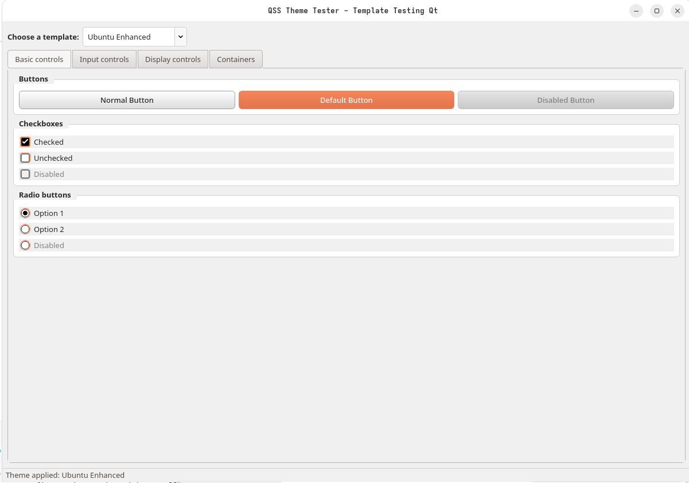

<div align="center">



# 🎨 Enhanced Qt StyleSheets Collection

[](https://www.qt.io/)
[](https://www.python.org/)
[](https://pypi.org/project/PyQt6/)
[](LICENSE)
[](https://github.com/GTRONICK/QSS)

**🚀 A comprehensive collection of enhanced Qt StyleSheets with modern design patterns, complete widget coverage, and integrated SVG icon system**

[🎯 Features](#-features) • [📦 Installation](#-installation) • [🎨 Themes](#-available-themes) • [🧪 Testing](#-theme-tester-application) • [📚 Documentation](#-documentation)

---

</div>

## 🌟 Overview

This is an **enhanced collection** of Qt StyleSheets (QSS) with custom SVG icons and improved component coverage. Built upon the excellent foundation by **Jaime A. Quiroga P. (GTRONICK)** and enhanced with modern UI/UX principles.

## ✨ Features

<table>
<tr>
<td align="center">🎨</td>
<td><strong>Custom SVG Icons</strong><br/>Scalable vector icons for all UI elements</td>
</tr>
<tr>
<td align="center">🚀</td>
<td><strong>Enhanced Themes</strong><br/>Improved versions of popular themes</td>
</tr>
<tr>
<td align="center">🔧</td>
<td><strong>Complete Widget Coverage</strong><br/>Support for all major Qt widgets</td>
</tr>
<tr>
<td align="center">📱</td>
<td><strong>Modern Design</strong><br/>Updated with contemporary UI/UX principles</td>
</tr>
<tr>
<td align="center">♿</td>
<td><strong>Accessibility</strong><br/>Better contrast and usability</td>
</tr>
<tr>
<td align="center">⚡</td>
<td><strong>Performance Optimized</strong><br/>Efficient CSS rendering and loading</td>
</tr>
</table>

## 🎨 Available Themes

<div align="center">

### 🌟 Enhanced Themes (New)

<table>
<tr>
<td align="center">

<br/><strong>MacOS-Enhanced.qss</strong>
<br/>Modern macOS-style with custom SVG icons
</td>
<td align="center">

<br/><strong>MaterialDark-Enhanced.qss</strong>
<br/>Material Design dark theme enhanced
</td>
<td align="center">

<br/><strong>Ubuntu-Enhanced.qss</strong>
<br/>Ubuntu-inspired with enhanced components
</td>
</tr>
</table>

### 📦 Original Themes

<table>
<tr>
<td align="center">

<br/><strong>Ubuntu.qss</strong>
</td>
<td align="center">

<br/><strong>ElegantDark.qss</strong>
</td>
<td align="center">

<br/><strong>MaterialDark.qss</strong>
</td>
</tr>
<tr>
<td align="center">

<br/><strong>ConsoleStyle.qss</strong>
</td>
<td align="center">

<br/><strong>AMOLED.qss</strong>
</td>
<td align="center">

<br/><strong>Aqua.qss</strong>
</td>
</tr>
<tr>
<td align="center">

<br/><strong>ManjaroMix.qss</strong>
</td>
<td align="center">

<br/><strong>NeonButtons.qss</strong>
</td>
<td align="center">

<br/><strong>MacOS.qss</strong>
</td>
</tr>
</table>

</div>

## 🎯 Icon System

<div align="center">

### 📁 SVG Icons Collection

<table>
<tr>
<td align="center">

<br/>
<code>arrow-up.svg</code> • <code>arrow-down.svg</code><br/>
<code>arrow-left.svg</code> • <code>arrow-right.svg</code>
</td>
</tr>
</table>

### ✨ Icon Features

<table>
<tr>
<td align="center">📏</td>
<td><strong>Scalable</strong><br/>Vector-based for any size without quality loss</td>
</tr>
<tr>
<td align="center">🎨</td>
<td><strong>Customizable</strong><br/>Easy to modify colors, strokes, and styles</td>
</tr>
<tr>
<td align="center">🎯</td>
<td><strong>Consistent</strong><br/>Unified design language across all themes</td>
</tr>
<tr>
<td align="center">⚡</td>
<td><strong>Performance</strong><br/>Optimized SVG code for fast rendering</td>
</tr>
</table>

</div>

## 📦 Installation

<div align="center">

### 🚀 Quick Start

<table>
<tr>
<td align="center">

<br/>
<code>git clone https://github.com/GTRONICK/QSS.git</code>
</td>
<td align="center">

<br/>
<code>pip install -r requirements.txt</code>
</td>
<td align="center">

<br/>
<code>python theme_tester.py</code>
</td>
</tr>
</table>

</div>

## 💻 Usage

### 🔧 C++ Integration
```cpp
#include <QApplication>
#include <QFile>
#include <QTextStream>

int main(int argc, char *argv[])
{
    QApplication app(argc, argv);
    
    // 📁 Load stylesheet from file
    QFile file("MacOS-Enhanced.qss");
    if (file.open(QFile::ReadOnly | QFile::Text)) {
        QTextStream stream(&file);
        QString styleSheet = stream.readAll();
        app.setStyleSheet(styleSheet);
        file.close();
    }
    
    return app.exec();
}
```

### 🐍 Python Integration
```python
import sys
from PyQt6.QtWidgets import QApplication
from PyQt6.QtCore import QFile, QTextStream

def load_stylesheet(file_path):
    """Load QSS stylesheet from file"""
    file = QFile(file_path)
    if file.open(QFile.OpenModeFlag.ReadOnly | QFile.OpenModeFlag.Text):
        stream = QTextStream(file)
        stylesheet = stream.readAll()
        file.close()
        return stylesheet
    return ""

app = QApplication(sys.argv)

# 🎨 Apply enhanced theme
stylesheet = load_stylesheet("MaterialDark-Enhanced.qss")
app.setStyleSheet(stylesheet)

# Your application code here...
sys.exit(app.exec())
```

### 📦 Resource File Integration
```xml
<!-- resources.qrc -->
<RCC>
    <qresource prefix="/themes">
        <file>MacOS-Enhanced.qss</file>
        <file>MaterialDark-Enhanced.qss</file>
        <file>Ubuntu-Enhanced.qss</file>
    </qresource>
    <qresource prefix="/icons">
        <file>icons/svg/arrow-up.svg</file>
        <file>icons/svg/arrow-down.svg</file>
        <file>icons/svg/checkbox-checked.svg</file>
        <file>icons/svg/radio-checked.svg</file>
        <!-- Add all other SVG icons -->
    </qresource>
</RCC>
```

## 🧩 Supported Components

<div align="center">

### 🎯 Enhanced Widget Coverage

<table>
<tr>
<td align="center">

<br/>
<strong>QMainWindow</strong> • <strong>QDialog</strong> • <strong>QWidget</strong>
</td>
<td align="center">

<br/>
<strong>QPushButton</strong> • <strong>QToolButton</strong> • <strong>QCheckBox</strong> • <strong>QRadioButton</strong>
</td>
</tr>
<tr>
<td align="center">

<br/>
<strong>QLineEdit</strong> • <strong>QTextEdit</strong> • <strong>QComboBox</strong> • <strong>QSpinBox</strong>
</td>
<td align="center">

<br/>
<strong>QSlider</strong> • <strong>QProgressBar</strong> • <strong>QScrollBar</strong>
</td>
</tr>
<tr>
<td align="center">

<br/>
<strong>QMenuBar</strong> • <strong>QMenu</strong> • <strong>QTabWidget</strong> • <strong>QStatusBar</strong>
</td>
<td align="center">

<br/>
<strong>QTreeView</strong> • <strong>QListView</strong> • <strong>QTableView</strong> • <strong>QHeaderView</strong>
</td>
</tr>
<tr>
<td align="center">

<br/>
<strong>QGroupBox</strong> • <strong>QSplitter</strong> • <strong>QToolBox</strong> • <strong>QDockWidget</strong>
</td>
<td align="center">

<br/>
<strong>QCalendarWidget</strong> • <strong>QToolTip</strong> • <strong>QFrame</strong>
</td>
</tr>
</table>

### ✨ Enhanced Features

<table>
<tr>
<td align="center">🎯</td>
<td><strong>Focus States</strong><br/>Better visual feedback for focused elements</td>
</tr>
<tr>
<td align="center">🚫</td>
<td><strong>Disabled States</strong><br/>Proper styling for disabled components</td>
</tr>
<tr>
<td align="center">🎭</td>
<td><strong>Hover Effects</strong><br/>Smooth hover transitions and animations</td>
</tr>
<tr>
<td align="center">🎨</td>
<td><strong>Custom Icons</strong><br/>SVG-based icons for all interactive elements</td>
</tr>
<tr>
<td align="center">📝</td>
<td><strong>Better Typography</strong><br/>Improved font choices and sizing</td>
</tr>
<tr>
<td align="center">♿</td>
<td><strong>Accessibility</strong><br/>Enhanced contrast ratios and usability</td>
</tr>
<tr>
<td align="center">📐</td>
<td><strong>Modern Spacing</strong><br/>Consistent padding and margins</td>
</tr>
</table>

</div>

## 🧪 Theme Tester Application

<div align="center">


**🚀 Interactive theme testing application with live preview and comprehensive widget showcase**

</div>

## 📸 Theme Gallery

<div align="center">

### 🌊 Aqua Theme
<table>
<tr>
<td align="center">

<br/><strong>Main Interface</strong><br/>
Clean aqua-blue design with modern gradients
</td>
<td align="center">

<br/><strong>Widget Gallery</strong><br/>
Comprehensive component showcase
</td>
</tr>
</table>

### 🍎 macOS Theme
<table>
<tr>
<td align="center">

<br/><strong>macOS Style Interface</strong><br/>
Native macOS look and feel
</td>
<td align="center">

<br/><strong>Control Elements</strong><br/>
Apple-inspired design patterns
</td>
</tr>
</table>

### 🐧 Ubuntu Theme
<table>
<tr>
<td align="center">

<br/><strong>Ubuntu-Inspired Design</strong><br/>
Orange accents with modern Ubuntu styling and comprehensive widget coverage
</td>
</tr>
</table>

### ✨ Theme Features Showcase

<table>
<tr>
<td align="center">

<br/>
<strong>🎯 Real-time Testing</strong><br/>
Switch themes instantly and see changes immediately
</td>
<td align="center">

<br/>
<strong>🧩 Complete Coverage</strong><br/>
All Qt widgets organized in intuitive categories
</td>
<td align="center">

<br/>
<strong>🎮 Interactive Elements</strong><br/>
Test hover, focus, and disabled states
</td>
</tr>
</table>

</div>

### 🎯 Features

- **🎨 Live Theme Switching** - Change themes instantly without restart
- **📱 Comprehensive Widget Gallery** - All Qt widgets in organized tabs
- **🔧 Interactive Examples** - Test hover, focus, and disabled states
- **📊 Performance Monitoring** - Theme loading times and resource usage
- **🌐 Arabic Interface** - Right-to-left layout support

### 🚀 Quick Start

```bash
# Run the theme tester
python theme_tester.py

# Or use the helper script
python run_theme_tester.py
```

### 📋 Widget Categories

<table>
<tr>
<td align="center">

<br/>Buttons, Checkboxes, Radio buttons
</td>
<td align="center">

<br/>Text fields, Combo boxes, Spin boxes
</td>
</tr>
<tr>
<td align="center">

<br/>Sliders, Progress bars, Lists, Tables
</td>
<td align="center">

<br/>Splitters, Tool boxes, Tab widgets
</td>
</tr>
</table>

## 📊 Theme Comparison

<div align="center">

<table>
<tr>
<th align="center">🎨 Feature</th>
<th align="center">

</th>
<th align="center">

</th>
<th align="center">

</th>
</tr>
<tr>
<td align="center"><strong>🎭 Style</strong></td>
<td align="center">Modern macOS</td>
<td align="center">Material Design</td>
<td align="center">Ubuntu-inspired</td>
</tr>
<tr>
<td align="center"><strong>🎨 Colors</strong></td>
<td align="center">Blue accents</td>
<td align="center">Green accents</td>
<td align="center">Orange accents</td>
</tr>
<tr>
<td align="center"><strong>🎯 Icons</strong></td>
<td align="center">✅ Custom SVG</td>
<td align="center">✅ Custom SVG</td>
<td align="center">✅ Custom SVG</td>
</tr>
<tr>
<td align="center"><strong>🌈 Gradients</strong></td>
<td align="center">Subtle</td>
<td align="center">Minimal</td>
<td align="center">Rich</td>
</tr>
<tr>
<td align="center"><strong>📐 Borders</strong></td>
<td align="center">Rounded</td>
<td align="center">Sharp/Rounded</td>
<td align="center">Rounded</td>
</tr>
<tr>
<td align="center"><strong>🎯 Best For</strong></td>
<td align="center">Desktop apps</td>
<td align="center">Modern apps</td>
<td align="center">Linux apps</td>
</tr>
</table>

</div>

## 🛠️ Customization

<div align="center">

### 🎨 Easy Theme Customization

<table>
<tr>
<td align="center">

<br/>
<strong>Color Schemes</strong>
</td>
<td align="center">

<br/>
<strong>Custom Icons</strong>
</td>
<td align="center">

<br/>
<strong>Typography</strong>
</td>
</tr>
</table>

</div>

### 🎨 Changing Colors
```css
/* 🎯 Change accent color */
QPushButton {
    border-color: #your-accent-color;
    background-color: #your-background-color;
}

/* 🌈 Selection colors */
QWidget {
    selection-background-color: #your-selection-color;
    selection-color: #your-text-color;
}
```

### 🖼️ Custom Icons
Replace SVG files in `icons/svg/` directory:
```bash
# 📁 Icon structure
icons/svg/
├── arrow-up.svg      # ⬆️ Navigation
├── checkbox-*.svg    # ☑️ Form controls
└── radio-*.svg       # 🔘 Radio buttons
```

### 📝 Font Customization
```css
/* 🔤 Global font settings */
QWidget {
    font-family: "Segoe UI", "SF Pro Display", "Ubuntu", sans-serif;
    font-size: 14px;
    font-weight: 400;
}

/* 📱 Platform-specific fonts */
QWidget[platform="windows"] { font-family: "Segoe UI"; }
QWidget[platform="macos"] { font-family: "SF Pro Display"; }
QWidget[platform="linux"] { font-family: "Ubuntu"; }
```

## ⚡ Performance & Compatibility

<div align="center">

<table>
<tr>
<td align="center">

</td>
<td align="center">

</td>
<td align="center">

</td>
</tr>
</table>

### 🚀 Performance Tips

- **📦 Icon Optimization**: Use compressed SVG files
- **🌈 Gradient Limits**: Minimize complex gradients
- **🎯 Selector Specificity**: Use targeted CSS selectors
- **💾 Resource Bundling**: Package assets in Qt resource files

</div>

## 🤝 Contributing

<div align="center">


</div>

### 🎨 Adding New Icons
1. **📐 Create** SVG with 16x16 viewBox
2. **🎨 Use** `currentColor` for dynamic coloring
3. **⚡ Optimize** SVG code for performance
4. **📁 Add** to `icons/svg/` directory
5. **🔗 Reference** in theme files

### 🎭 Creating New Themes
1. **📋 Copy** enhanced theme as base
2. **🎨 Modify** color scheme variables
3. **🔧 Adjust** component styling
4. **🧪 Test** with theme tester application
5. **📚 Document** theme characteristics

## 📄 License & Credits

<div align="center">

<table>
<tr>
<td align="center">

<br/>
<strong>MIT License</strong><br/>
Same as original QSS collection
</td>
<td align="center">

<br/>
<strong>Jaime A. Quiroga P.</strong><br/>
Original QSS collection creator
</td>
</tr>
</table>

### 🙏 Acknowledgments
- **🎨 Enhanced Version**: Modern UI/UX improvements
- **🎯 Custom Icons**: Scalable SVG icon system
- **🧪 Testing**: Community feedback and testing
- **📚 Documentation**: Comprehensive guides and examples

</div>

## 📈 Changelog

<div align="center">

### 🌟 Version 2.0 (2025) - Enhanced Edition

<table>
<tr>
<td align="center">✨</td>
<td><strong>Custom SVG Icon System</strong><br/>Scalable vector graphics for all UI elements</td>
</tr>
<tr>
<td align="center">🎨</td>
<td><strong>Enhanced Theme Versions</strong><br/>MacOS, MaterialDark, and Ubuntu themes improved</td>
</tr>
<tr>
<td align="center">🔧</td>
<td><strong>Complete Widget Coverage</strong><br/>Support for all major Qt widgets</td>
</tr>
<tr>
<td align="center">📱</td>
<td><strong>Modern Design Principles</strong><br/>Contemporary UI/UX patterns</td>
</tr>
<tr>
<td align="center">♿</td>
<td><strong>Accessibility Features</strong><br/>Better contrast and usability</td>
</tr>
<tr>
<td align="center">🧪</td>
<td><strong>Theme Tester Application</strong><br/>Interactive testing and preview tool</td>
</tr>
</table>

### 📦 Version 1.0 (Original)
- Initial theme collection by GTRONICK
- Basic component styling
- System-dependent icons

</div>

## 🆘 Support & Issues

<div align="center">


**For bug reports and feature requests, please provide:**

</div>

<table>
<tr>
<td align="center">🖥️</td>
<td><strong>System Info</strong><br/>Qt version, Platform, OS version</td>
</tr>
<tr>
<td align="center">🎨</td>
<td><strong>Theme Details</strong><br/>Which theme and component affected</td>
</tr>
<tr>
<td align="center">🐛</td>
<td><strong>Bug Description</strong><br/>Expected vs actual behavior</td>
</tr>
<tr>
<td align="center">📷</td>
<td><strong>Screenshots</strong><br/>Visual examples when possible</td>
</tr>
</table>

---

<div align="center">

**🎉 Thank you for using Enhanced Qt StyleSheets! 🎉**

[]([https://github.com/GTRONICK/QSS](https://github.com/hammam999/Enhanced-Qt-StyleSheets-Collection))
[](https://www.qt.io/)

</div>
